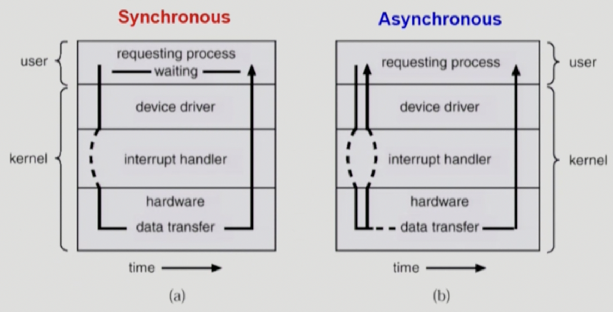

# System Structure & Program Execution

## 1. System Structure & Program Execution 1

## 컴퓨터 시스템 구조

[컴퓨터 하드웨어 구조]

<p align="center">
  
</p>

현대의 컴퓨터 시스템은 공유 메모리에 대한 접근을 제공하는 공통 버스를 통해 여러 개의 장치 제어기와 하나 이상의 CPU로 구성되어 있다.

- CPU + Memory   `== Computer`
- I/O device
  - 
      - Input → I/O 디바이스의 데이터가 컴퓨터 메모리로 들어가는 것
      - Output → CPU의 처리 결과를 I/O 디바이스로 데이터를 내보내는 것
   

<br>

[컴퓨터 하드웨어 구조(**detail**)]

<p align="center">
  
</p>

### **Memory**

- CPU의 작업 공간

CPU가 일을 할 때 작업공간인 Memory에서 매 순간 메모리에 저장된 기계어를 읽는다.

<br>

### **I/O device**

- `Input device` → 입력 장치 (키보드, 마우스)
- `Output device` → 출력 장치 (프린터, 모니터)
- `HDD`(보조기억장치) → 일종의 I/O device
    - 데이터를 읽어서 Memory로 읽어들이기도 하고 (Input device의 역할)
    - 처리 결과를 디스크의 파일 시스템에 저장하기도 한다 (Output device의 역할)

- **`device controller`** : 해당 I/O 장치를 **관리**하는 일종의 작은 CPU의 역할을 한다
    
        ```
        디스크에서 헤드가 어떻게 움직이고 어떤 데이터를 읽을지 등 내부를 통제하는 일들은 CPU가 아니라 각각의 I/O 컨트롤러들이 수행하는 것이다. 
        (디스크 컨트롤러, 키보드 컨트롤러, 마우스 컨트롤러 등등..)
         ```
    
   - 제어 정보를 위해 control register(제어 레지스터), status register(상태 레지스터)를 가짐
        - CPU가 일을 시킬 때 해당 레지스터를 통해 일을 시키기 때문에 제어 정보를 담는 레지스터라고 부르는 것
    - local buffer를 가짐 (일종의 data register)
    - 예) 데이터 저장은 local buffer, 화면에 출력을 하라는 지시는 control register(제어 레지스터)가 수행한다고 보면 됨.
    
    ```
    I/O는 실제 device와 local buffer 사이에서 일어남.
    Device controller는 I/O가 끝났을 경우 interrupt로 CPU에 그 사실을 알림.
    
    * device driver (장치구동기) : OS 코드 중 각 장치별 처리 루틴 → software (설치)
    * device controller (장치제어기) : 각 장치를 통제하는 일종의 작은 CPU → hardware
    ```

- **`local buffer`** : 메인 CPU의 작업공간인 메인메모리가 있듯이, device controller도 그들의 작업 공간인 local buffer를 가짐

<br>

###  **CPU**

 **[CPU의 cycle]**

1. CPU의 운명은 다음 수행할 instruction의 메모리 주소를 갖고 있는 레지스터인 PC에서 주소를 알아내 Memory에서 instruction 하나 읽어서 실행하고 그 다음 instruction을 읽어서 실행하는 것을 반복하는 것. 
2. Instruction은 주로 4Byte이기 때문에 PC값은 명령어를 하나씩 수행할 때마다 4씩 증가함
3. CPU는 다음 수행할 명령어를 수행하기 전에 interrupt line을 통해 인터럽트가 들어온게 있는지를 확인
4. 인터럽트가 들어오면 현재 하고 있던 작업을 멈추고 CPU 제어권을 OS에게 넘


<p>
  
</p>

- **`register`** : Memory보다 더 빠르면서 정보를 저장할 수 있는 CPU 안의 공간
- **`mode bit`** : CPU안에서 실행되는 것(CPU 제어권)이 **운영체제**인지 **사용자 프로그램**인지를 구분자
  
    ```
     사용자 프로그램의 잘못된 수행으로 다른 프로그램 및 운영체제에 피해가 가지 않도록 하기 위한 보호 장치가 필요하기 때문에 Mode bit을 통해 하드웨어적으로 두 가지 모드의 operation을 지원한다.
    ```
    
    - 0️⃣ : 운영체제가 CPU를 갖고 있을 때 → 모든 코드가 수행 가능함(OS 코드 수행)
        - monitor mode / **kernel mode**
            - 보안을 해칠 수 있는 중요한 명령어는 kernel mode에서만 수행 가능한 **특권 명령**으로 규정.
    - 1️⃣ : 사용자 프로그램이 CPU를 갖고 있을 때 → 제한된 프로그램 명령어만 사용 가능함.
        - **user mode** (사용자 모드)
            - **일반 명령**만 사용 가능.
          
    <p>
        
    </p>
  
    - **mode bit cycle**
      - Interrupt나 Exception 발생시 하드웨어가 mode bit을 0으로 바꿈
      - 사용자 프로그램에게 CPU를 넘기기 전에 mode bit을 1로 셋팅
    
- **`interrupt line`** : CPU가 Instruction을 수행하면서 **Interrupt**가 있는지 확인하는 공간이다. 주기적으로 확인하여 추가적으로 들어온 **Interrupt**가 있는지 확인하는 것
     
    ```
    CPU는 항상 Memory에 있는 instruction만 계속 실행한다. 정확히는 instruction하나가 실행되고 나면 기계어의 주소값이 증가하고 다음 사이클에서는 그다음 instruction을 실행하는 일을 반복해서 실행하고 있는 것이다. 근데 갑자기 키보드에서 어떤 입력이 들어왔다던지, 또는 Disk에서 어떤 것을 읽어와야 한다던지 또는 Disk에 뭔가 읽어오라고 요청을 했는데 그 일을 다 끝냈다던지 하는 I/O가 수행하는 일들을 CPU가 어떻게 아느냐?
   
    → I/O가 수행한 일들을 CPU에게 `전달`하기 위해 `interrupt line`이 붙어있는 것!
    ```
    
    1. CPU가 인터럽트되면 CPU는 하던 일을 중단하고, 즉시 인터럽트를 위한 서비스 루틴이 위치한 시작 주소를 가지고 있는 인터럽트 벡터로 실행을 옮긴다. 
    2. 그리고 인터럽트 서비스 루틴이 실행된다. 
    3. 인터럽트 서비스 루틴의 실행이 완료되면
    4. CPU는 인터럽트 되었던 연산을 재개한다.
    
- **`Timer`** : 특정 프로그램이 CPU를 독점하지 못하게 막기 위한 하드웨어 장치
     
    ```
    계속 CPU만 쓰는 무한루프 프로그램을 만든다면 CPU가 다른 프로그램으로 절대 넘어가지 못해서 time-sharing을 구현할 수가 없기 때문에 컴퓨터 안에는 timer라는 하드웨어를 두고 있음.
     
    timer의 역할은 특정 프로그램이 CPU를 독점하지 못하게 막는 것. 처음에 컴퓨터를 켜면 운영체제가 CPU를 가지고 있다가 여러 프로그램(사용자 프로그램)이 실행되면 사용자 프로그램에게 CPU를 넘겨주게 됨. 이 때 그냥 넘겨주는게 아니라 timer로 특정 시간을 세팅해두고 프로그램에게 CPU를 넘겨주게 됨. 
    
    작업을 수행하다가 시간이 다 되면 timer가 CPU에게 interrupt를 검 → CPU는 매번 instruction을 하나씩 실행하다가 하나의 실행이 끝나게 되면 interrupt line을 체크 → 없으면 다시 instruction 수행 → 수행 종료 시 다시 interrupt line 체크 반복.
    ```
    
    - 정해진 시간이 흐른 뒤 운영체제에게 제어권이 넘어가도록 인터럽트를 발생시킴
    - 타이머는 매 클럭 틱 때마다 1씩 감소
    - 타이머 값이 0이 되면 타이머 인터럽트 발생
    - **CPU를 특정 프로그램이 독점하는 것으로부터 보호**
        - CPU가 작업을 수행하다가 interrrupt가 들어오면 CPU는 하던 일을 잠시 멈추고 CPU의 제어권이 사용자의 프로그램으로부터 운영체제로 자동으로 넘어가게 되어있음. 운영체제가 사용자 프로그램에게 제어권을 줄 때는 자유롭게 주지만, 뺏을 때는 자유롭지 않음(interrupt가 이루어져야만 제어권 재획득 가능). 그래서 추가적인 하드웨어를 둬서 timer가 인터럽트를 걸 수 있도록 설계한 것.
        - 운영체제가 CPU를 얻게 되면 다음 프로그램에게 CPU를 넘겨주는데, 이 때도 timer에다 time-sharing 시간을 설정해서 넘겨줌.
    

Timer는 time sharing을 구현하기 위해 널리 이용되고, 현재 시간을 계산하기 위해서도 사용됨

- **`DMA Controller`** (Direct Memory Access controller)
     
    ```
    CPU → 메모리도 접근할 수 있고, 로컬 버퍼 접근도 할 수 있음
    
    device controller → 자기 자신의 로컬 버퍼만 접근할 수 있음
    
    그렇게 하다 보니 CPU가 너무 인터럽트를 많이 당하게 되어 이 때마다 인터럽트를 처리해주어야 하기 때문에 빠른 CPU장치가 효율적으로 사용되지 않는 `문제 발생`
    
    → 그래서 DMA(Direct Memory Access == 직접 메모리를 접근할 수 있는 컨트롤러) **Controller**를 하나 더 두고 사용하고 있음.
    
    ⇒ 원래 메모리에 직접 접근할 수 있는 장치는 CPU 뿐이었는데 DMA controller를 두게 되면 DMA도 메모리에 직접 접근이 가능. 그런데 이렇게 두 장치가 메모리에 접근 가능하게 되면 특정 메모리 영역에 동시에 접근하게 되는 문제가 발생할 수가 있어서 이 때 `memory controller`가 이를 조율하고 관리하는 역할을 해주고 있음.
    ```
    
    - 빠른 입출력 장치(인터럽트를 더 빈번히 걸게됨)를 메모리에 가까운 속도로 처리하기 위해 사용
        - CPU는 계속 자기 일을 하고 있고 I/O 요청의 작업이 끝나 각 local buffer에 값이 들어오면 **DMA가 직접 메모리로 값을 복사해주는 일을 수행함.**
    - CPU의 중재 없이 device controller가 device의 buffer storage의 내용을 메모리에 block 단위로 직접 전송
    - 바이트 단위가 아니라 block 단위로 인터럽트를 발생시킴
    
<br>

### **입출력(I/O)의 수행**

```
 입출력을 수행하기 위해서는 → 하드웨어 인터럽트, 소프트웨어 인터럽트 둘다 필요하다.
```

- 모든 입출력 명령은 특권 명령이다.
- 사용자 프로그램은 어떻게 I/O를 하는가?
    1. `I/O 요청` → `시스템콜(system call)` 
        - 사용자 프로그램은 운영체제에게 I/O 요청 (= 내 프로그램이 실행되다가 I/O 요청을 하기 위해 운영체제의 함수를 호출하는 것)
            
            ```
             mode bit이 1인 상황이라 OS에 직접 접근이 불가능하기 때문에 프로그램이 OS에게 무언가를 요청하고 싶어서 'software적으로 직접 interrupt line을 세팅하는 코드를 실행'함. 
          
            → 이 때 인터럽트가 들어왔기 때문에 mode bit이 0으로 바뀌고 CPU 제어권이 OS에게 넘어가게 됨.
            ```
            
    2. trap을 사용하여 인터럽트 벡터의 특정 위치로 이동
    3. 제어권이 인터럽트 벡터가 가리키는 인터럽트 서비스 루틴으로 이동
    4. 올바른 I/O 요청인지 확인 → 올바른 요청일 경우 I/O controller에게 I/O 요청을 부탁 → I/O 수행
    5. `I/O 완료` 시 → `하드웨어 인터럽트`를 걸어줌 → 제어권을 시스템콜 다음 명령으로 옮김

    <br>

###  인터럽트 (Interrupt)

```
현대의 운영체제는 인터럽트에 의해 구동됨

→ 운영체제는 CPU를 잡을 일이 없음. 인터럽트가 들어올 때만 CPU가 운영체제에게 넘어가는 것이지 그렇지 않을 때에는 사용자 프로그램이 CPU를 사용함.
```

- 인터럽트
    - 인터럽트 당한 시점의 레지스터와 PC를 save한 후 CPU의 제어를 인터럽트 처리 루틴에 넘긴다.
- Interrupt (넓은 의미)
    - `Interrupt` (**하드웨어** 인터럽트) : 하드웨어가 발생시킨 인터럽트 (Timer, I/O controller..)
    - `Trap` (**소프트웨어** 인터럽트)
        - Exception: 프로그램이 오류를 범한 경우
        - System call: 프로그램이 커널 함수를 호출하는 경우
- 인터럽트 관련 용어
    - 인터럽트의 종류가 다양하고 각 인터럽트마다 해야하는 일이 각기 다를 것임.
        - `인터럽트 벡터`
            - 인터럽트 번호와 주소의 쌍
            - 해당 **인터럽트의 처리 루틴 주소를 가지고 있음**
        - `인터럽트 처리 루틴` (= Interrupt Service Routine, 인터럽트 핸들러)
            - 해당 인터럽트를 처리하는 커널 **함수**
            - 실제 인터럽트를 처리하는 부분

<br>
    
### 시스템콜 (System Call)

- 사용자 프로그램이 운영체제의 서비스를 받기 위해 커널 함수를 호출하는 것


사용자 프로그램이 운영체제에게 무언가를 부탁할 때 → System Call을 통해 부탁함.

---

<br>

## 2. System Structure & Program Execution 2

### 동기식 입출력과 비동기식 입출력


<p>
    
</p>


```
I/O는 kernel을 통해서만 요청 가능 (user는 직접 I/O 요청 불가)
→ 사용자 프로그램이 운영체제 I/O 요청을 운영 체제 kernel에게 하게되면 I/O 장치에 맞는 device driver들을 거치고 실제 하드웨어들을 통해서 I/O를 읽거나 쓰는 작업을 하게 됨. 근데 I/O 작업은 꽤나 시간이 오래 걸리는 작업이라 시간이 흘러야지만 I/O가 끝난 것이 도착하는데,

1) 이 I/O 작업이 끝나는 것을 사용자가 기다린다면 `Synchronous I/O`
2) 이 I/O 작업이 끝나는 것을 사용자가 기다리지 않고 요청만 해놓고 바로 CPU 제어권을 얻어서 다른 작업들을 수행한다면 `asynchronous I/O`

⇒ 두 경우 모두 I/O의 완료는 해당 I/O device controller가 인터럽트를 걸어서 “요청한 I/O 작업이 끝났다”고 알려줌
```


`동기식 입출력` (synchronous I/O) → 서로 맞추는 것

- I/O 요청 후 입출력 작업이 완료된 후에야 제어가 사용자 프로그램에 넘어감
- 구현 방법 1
    - I/O가 끝날 때까지 CPU를 낭비시킴
    - 매시점 하나의 I/O만 일어날 수 있음
  
        ⇒  `CPU 낭비, I/O장치도 낭비`
        
- 구현 방법 2
    - I/O가 완료될 때까지 해당 프로그램에게서 CPU를 빼앗음
    - I/O가 처리를 기다리는 줄에 그 프로그램을 줄 세움
    - 다른 프로그램에게 CPU를 줌
  
      ⇒  `CPU 낭비, I/O장치도 낭비를 해결`
    

`비동기식 입출력` (asynchronous I/O)

- I/O가 시작된 후 입출력 작업이 끝나기를 기다리지 않고 제어가 사용자 프로그램에 즉시 넘어감 (프로세스 차원에서 제어)
- I/O 요청을 했지 지금 I/O 결과를 보지 않고, 할 수 있는 작업이 있을 때 비동기식으로 실행

<br>


### 서로 다른 입출력 명령어

<p>
    
</p>

- CPU에서 수행하는 instruction에는 Memory를 접근하는 instruction `(load store)`, I/O 장치를 접근하는 instruction이 있다.
- `I/O의 관점에서`
    - 좌측) `일반적인 I/O 방식` 메모리 접근 ↔ I/O 접근 instruction 분리
    - 우측) I/O 디바이스들에 메모리 주소값을 부여하고, 메모리로 접근 한다 (Memory Mapped I/O)
    
<br>


### 저장장치 계층 구조

<p>
    
</p>

- 맨 위는 CPU
- CPU가 직접 접근 가능한 매체(바이트 단위로 접근이 가능한) → `Primary`
- CPU가 직접 접근이 불가능한 매체 → `Secondary`
  - HDD → 섹터 단위로 접근

```
 CPU와 가까울수록

speed ⬆︎
volume ⬇︎
price ⬆︎
volatility(휘발성) ⬆︎
```

<br>


### 프로그램의 실행 (메모리 load)

<p>
    
</p>

```
프로그램 실행 
→ 해당 프로그램의 독자적인 주소 공간이 Virtual memory에 만들어짐 (code, data, stack으로 구성) 
→ 물리적인 메모리에 올려서 사용
```

- 메모리 낭비를 막기 위해 모든 공간을 물리적인 메모리에 통째로 올려서 사용하는 것이 아니라 사용되는 프로그램의 주소 공간만 올려서 사용
- Swap area의 내용 : 메모리 용량의 한계로 메모리 연장공간으로서 사용되는 용도이기에 컴퓨터 전원이 꺼지면 휘발되는 내용
- Physical memory: 주소 변환됨 → 메모리 관리 부분에서 더 심화적으로 다룰 예정

<br>

### 커널 주소 공간의 내용

- 운영체제 kernel 또한 하나의 주소 공간이기에 address space를 가짐


- 현재 실행중인 프로그램들을 관리하기 위한 자료구조가 필요함 (어떤 프로그램이 CPU를 얼마나 썼는지 .. 다음에 누구에게 메모리를 얼마나 줘야 할지에 관한)
    - → 각 프로그램마다 운영체제가 관리하고 있는 자료구조가 필요한데 이걸 `PCB`라고 부름


- 사용자 프로그램들이 함수 호출을 해서 커널을 불러 쓰기 때문에 (프로세스마다)사용자 프로그램마다 stack을따로 두고 스택을 사용하고 있음.

<br>

### 사용자 프로그램이 사용하는 함수

- 함수(function)
     
    - 사용자 정의 함수
        - 자신의 프로그램에서 정의한 함수
    - 라이브러리 함수
        - 자신의 프로그램에서 정의하지 않고 갖다 쓴 함수
        - 자신의 프로그램에서 실행 파일에 포함됨
    - 커널 함수
        - 운영체제 프로그램의 함수
        - 커널 함수의 호출 == `시스템 콜`

<br>

### 프로그램의 실행
```
user mode로 진행되다가 → System call이 생기면 CPU제어권이 OS로 넘어가면서 Kernel mode로 바뀌게 되고 → System call이 종료되면  CPU제어권이 사용자에게로 넘어가면서 다시 user mode로 바뀜 → 이를 반복
```