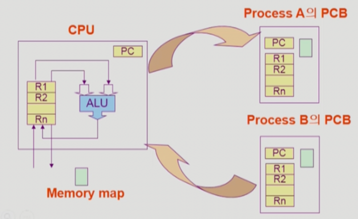

# Process

## 프로세스의 개념


```Process is a program in execution```


<p align="center">
  
</p>


**프로세스의 문맥(context)**

- 어느 시점을 딱 잘라놓고 봤을 때 그 프로그램이 무엇을 어떻게 실행했는지, 현재 시점이 어떤 상태에 있는지를 정확하게 나타내기 위해서 사용되는 개념

- CPU 수행 상태를 나타내는 하드웨어 문맥
    - Program Counter(PC) ← 코드의 다음 메모리 번지수를 가리킴
    - 각종 Register ← 현재 어떤 Instruction을 읽어들이는지
    - 어떤 값을 넣어두고 어떤 Instruction까지 실행했는가
  
- 프로세스의 주소 공간
    - Data : 사용하는 스태틱 변수, 상수 값
    - Stack : 이 프로세스의 스택 영역
    - Code : PC가 해당 프로세스의 실행중인 code영역을 가리키게 됨  
    
- 프로세스 관련 커널 자료 구조
    
    프로세스를 관리하기 위해서 자신의 data 영역에 PCB(Process Control Block)를 두고 있다.
    - 프로세스 마다 운영체제는 PCB를 하나씩 두고 있으면서 **프로세스의 문맥을 저장함**
        
    - 프로세스가 실행되다가 자신이 할 수 없는 일이 생기면 운영체제를 호출한다.(System call) 이 상황에서는 PC가 커널 주소 공간 어딘가를 가르키게 되고 커널의 코드를 실행하게 된다. 커널도 함수들로 구성되기 때문에 함수 호출이 일어나면 스택에다가 관련된 정보들을 쌓아둔다.

    - 커널의 codes는 ```프로세스들이 공유하는 코드```
        - 시스템 콜을 하면 커널의 코드를 실행하게 되고 커널에서 함수 호출이 일어나서 스택에 함수를 쌓을 때는 ```프로세스 별로 이 커널을 어떤 프로세스가 호출했는지에 별도로 두고 있다.```

```
현대의 컴퓨터 시스템에서는 Time-Sharing, Multi-tasking 등을 통해서 프로세스들이 번갈아 가면서 실행이 되기 때문에 현재 프로세스가 진행되는 걸 백업해놓지 않으면(= 문맥을 알아놓지 않으면) 다음번 CPU를 잡았을 때 앞 부분부터 다시 실행하는 문제가 생긴다. 문맥을 알아야 그 다음 시점부터 다시 실행이 가능해진다. → PCB
```
      
<br>


## 프로세스 상태도

<p align="center">
  
</p>

- New: 프로세스가 생성중인 상태
- Ready: 프로세서를 할당받으려고 기다리는 상태```(당장 CPU에서 instruction 실행에 필요한 data는 메인 메모리에 올림) == 최소한의 메모리```
- Running: 프로세서를 점유하여 명령어가 실행되는 상태
- Waiting(Blocked): 이벤트나 입출력 대기 신호 발생을 기다리는 상태

    - CPU를 주어도 당장 instruction을 수행할 수 없는 상태
    - Process 자신이 요청한 event(예: I/O)가 즉시 만족되지 않아 이를 기다리는 상태

- Terminated: 수행(execution)이 끝난 상태
- Suspended: ready/ waiting queue가 가득 차는 문제를 해결
  `외부에서 resume해 주어야 Active(외부 == 중계 스케줄러)`
  - system 전체의 부하를 증가시키지 않고 process에 서비스를 제공
  - 원인이 해소될 때까지 process를 suspend 상태에 두어 process가 원할하게 수행되도록 함
  - 장시간 중단 시 해당 프로세스에 할당된 자원 반환, 자원의 성질에 따라 반환 자원 결정
    - 메인 메모리: 프로세서 중단 즉시 반환
    - 보조 메모리: 중단 시간 예측할 수 없거나 너무 길 때 반환
  - 중단한 프로세스는 중단한 지점부터 다시 시작
    - PCB 보존

## 컴퓨터 시스템상에서 나타낸 프로세스 상태도

<p align="center">
  
</p>

1. 하나의 프로세스는 CPU를 독점하다가, CPU는 공유하는 자원이기에 timer interrupt가 들어오면 CPU를 뺏기고 Ready queue에 append된다.
2. 프로세스 Running 상태에서 I/O장치에서 읽어와야 할 때 상태는 Running에서 Waiting 바뀌고 I/O queue에 가서 줄을 서게 됨 ```이 때 I/O controller가 control함```
3. I/O 작업이 끝나면 I/O controller가 cpu에게 interrupt를 걸어 작업이 끝났음을 알리고 CPU는 하던 작업을 잠시 멈추고 CPU제어권을 운영체제 커널에게 넘어간다. ```modbit = 0```
4. 운영체제 커널은 I/O를 요청했던 프로세스의 작업이 끝났으니 해당 프로세스의 상태를 Wait → Ready로 바꿔서 CPU를 얻을 수 있는 상태로 바꿔준다.


<br>

## Process Control Block ```PCB```

<p align="center">
  
</p>

운영체제가 각 프로세를 관리하기 위해 프로세스당 유지하느 정보 ```커널 data영역```

***구성요소***
- OS가 관리상 사용하는 정보 ```운영체제가 프로세스를 관리하기 위한 정보```
  - Process state, Process ID ```PID```, Scheduling information, priority
- CPU 수행 관련 하드웨어 값 ```프로세스의 문맥을 표시하기 위한 정보```
    - Program counter, registers
- 메모리 관련
    - Code, data, stack의 위치 정보
- 파일 관련
    - Open file descriptors...
    
    
##  문맥 교환(Context Switching)

<p align="center">
  
</p>

- 실행중인 프로세스의 제어를 다른 프로세스에게 넘겨 Running 상태가 되도록 하는 것
  - 프로세스는 짧은 시간 간격으로 CPU를 얻었다가 뺏겼다가 하는 과정이 반복된다 → 뺏겼다가 다시 얻는 시점에서는 처음 부터 다시 실행하는 것이 아니라 뺏기던 시점의 문맥을 기억해두었다가 뻇긴 시점부터 일을 수행할 수 있게끔 하는 방법이 필요하다.

- ```운영체제가 Context Switching을 도와주는 과정(data영역에 각 PCB 저장)```
  - CPU를 내어주는 프로세스의 상태를 그 프로세스의 PCB에 저장`(register, pc, memory map)`
  - CPU를 새롭게 얻는 프로세스의 상태를 PCB에서 얻어옴

<br>
    
### System call이나 interrupt 발생시 반드시 문맥교환이 일어나는 것은 아님

<p align="center">
  
</p>

- 사용자 프로세스로부터 CPU가 운영체제로 넘어가는 것은 Context Switching이 아니다.
- (1)의 경우에도 CPU 수행 정보 등 context의 일부를 PCB에 save해야 하지만, 문맥교환을 하는 (2)의 경우 그 부담이 훨씬 큼 (eg. cache memory flush)

<br>

##  프로세스를 스케줄링하기 위한 큐

### Job queue

- 현재 시스템 내에 있는 모든 프로세스의 집합

### Ready queue

- 현재 메모리 내에 있으면서 CPU를 잡아서 실행되기를 기다리는 프로세스의 집합

### Device queues

- I/O device의 처리를 기다리는 프로세스의 집합

### Ready queue와 Device Queue
```
프로세서들은 각 큐들을 오가며 수행된다.
각 queue는 header, tail로 PCB를 줄을 세운다.(PCB는 pointer를 가지므로) 
```

<p align="center">
  
</p>

### 프로세스 스케쥴링 Queue의 모습

<p align="center">
  
</p>

## 스케줄러(Scheduler)

### Long-term scheduler (장기 스케줄러 or job scheduler)

- 시작 프로세스 중 어떤 것들을 `ready queue`로 보낼지 결정
- 프로세스에 `memory`(및 각종 자원)를 주는 문제
- `degree of Multiprogramming`을 제어 → 메모리를 줌으로써 멀티프로그래밍을 제어함.
- time sharing system에는 보통 장기 스케줄러가 없음 (무조건 ready)

### Short-term scheduler (단기 스케줄러 or CPU scheduler)

- 어떤 프로세스를 다음번에 `running`시킬지 결정
- 프로세스에 `CPU`를 주는 문제
- 충분히 빨라야 함 (millisecond 단위)
- [단기 스케줄러]
    
    CPU스케줄러라고도 하며 준비 상태의 프로세스 중에서 어던 프로세스를 다음 번에 실행 상태로 만들 것인지를 결정.
    시분할 시스템에서 타이머 인터럽트가 발생하면 단기 스케줄러가 호출됨.
    
    일반적으로 `스케줄러`라 함은 `단기 스케줄러`를 의미하며 단기 스케줄러는 미리 정한 스케줄링 알고리즘에 따라 CPU를 할당 할 프로세스를 선택함.
    
    단기 스케줄러는 밀리 세컨드(ms) 이하의 시간 단위로 매우 빈번하게 호출되기 때문에 수행 속도가 충분히 빨라야 한다.

### Medium-term scheduler (중기 스케줄러 or Swapper)

- 여유 공간 마련을 위해 프로세스를 통째로 메모리에서 디스크로 쫓아냄
- 프로세스에게서 `memory`를 뺏는 문제
- `degree of Multiprogramming`을 제어
- [중기 스케줄러]
    
    너무 많은 프로세스에게 메모리를 할당해 시스템의 성능이 저하되는 경우 이를 해결하기 위해 **메모리에 적재된 프로세스의 수를 동적으로 조절**하기 위해 추가된 스케줄러
    
    만약 메모리에 많은 수의 프로세스가 적재되어 프로세스 당 보유하고 있는 메모리량이 극도로 적어지게 되면 CPU 수행에 당장 필요한 프로세스의 주소 공간조차도 메모리에 올려놓기 어려운 상황이 발생하게 됨. 그렇게 되면 디스크 I/O가 수시로 발생하게 되어 시스템의 성능이 심각하게 저하될 수 있음. 이런 경우 메모리에 올라와 있는 프로세스 중 일부로 부터 메모리를 통째로 빼앗아 그 내용을 디스크의 스왑 영역에 저장해 둠. 이와 같은 행위를 **`스왑 아웃`**(swap out)이라고 함.
    
    디스크로 스왑 아웃시켜야 하는 경우 Blocked 상태에 있는 프로세스들을 첫번째로 스왑 아웃 시킴. 이유는 Blocked 상태의 프로세스들은 당장 CPU를 획득할 가능성이 없기 때문.
    
    Blocked 상태의 프로세스들을 스왑 아웃시켜도 문제가 해결되지 않는 경우 중기 스케줄러는 타이머 인터럽트가 발생해 준비 큐로 이동하는 프로세스를 추가적으로 스왑아웃 시킴. 중기 스케줄러는 이러한 방식으로 장기 스케줄러와 마찬가지로 메모리에 올라와 있는 프로세스의 수를 조절하는 역할을 함.
    
<br>

###Suspend 개념의 추가
**Suspended** 상태가 되었다는 것은 메모리를 완전히 잃어버리는 (swap-out)상태
```(하지만 별개로 I/O는 실행될 수 있으므로 이후에 I/O 작업이 완료되면 Suspended → Ready상태로 넘어갈 수 있다)```


<p align="center">
  
</p>

```
System call 발생 등으로 user mode에서 kernel mode로 진입하여 운영체제의 코드를 실행한다 하더라도, 사용자 프로세스가 kernel mode(운영체제의 모드)로 Running 중인 것이지 운영체제가 Running되는 것이 아니다.
```

<br>


## Thread

```
→ 동일한 일을 하는 프로세스가 여러개 있다고 할 때, 이 프로세스를 별도로 만들면 주소공간도 별도로 만들어지기 때문에 메모리 공간이 낭비됨 
→ 프로세스를 여러개 띄워두고 싶을 때 메모리 낭비를 막기 위해 프로세스를 하나만 띄워두고 (메모리 공간(주소공간)은 하나만 만들어두고) 각 프로세스마다 다른 코드를 실행할 수 있게 해주면 어떨까? ⇒ 'Thread'의 개념!
```

<p align="center">
  
</p>


<br>

### Thread란?

→ `CPU를 수행하는 단위`

프로세스 하나에 CPU 수행 단위만 여러개를 두고 있는 것을 Thread라고 함.

<p align="center">
  
</p>

- Thread의 구성
    - Program counter (PC)
    - register set
    - stack

- Thread가 동료 thread와 공유하는 부분(=task)
    - code
    - data
    - OS 자원

→ 전통적인 개념의 heavyweight process는 하나의 thread를 가지고 있는 task로 볼 수 있다.

```
Thread에서는, 프로세스간 공유할 수 있는 자원은 최대한 공유함 (code, data, Heap 등)

- 다만, CPU 수행과 관련된 부분(PC, register, stack)은 독자적으로 가짐
```


<br>

<p align="center">
  
</p>


<br>

### Thread의 장점

- `빠른 응답성(Responsiveness)`: 다중 스레드로 구성된 태스크 구조에서는 하나의 서버 스레드가 blocked(waiting)상태인 동안에도 동일한 태스크 내의 다른 스레드가 실행(running)되어 빠른 처리를 할 수 있다.

```
 네트워크를 통해서 웹페이지를 읽어오는 작업도 사실은 I/O 작업임. 네트워크를 통해 읽어오는 작업은 오래걸리기 때문에 내 웹 브라우저는 blocked상태가 됨 → 웹페이지를 다 읽어올 때 까지 화면에 아무것도 보이지 않기 때문에 사용자는 답답함 → 웹 브라우저를 여러개의 스레드를 사용해 프로그램을 만들어놓게 되면 하나의 스레드가 멀리 네이버 웹 서버에서 웹 페이지의 embedded된 image 같은 것들을 불러오는 동안에 thread를 Waiting시키지 않고 또 다른 스레드가 이미 읽어온 text라도 띄워 display를 해준다면 사용자가 결과를 더 빨리 볼 수 있게 됨. (빠른 응답성 제공) 일종
```

- `자원 절약(공유)`: 동일한 일을 수행하는 다중 스레드가 협력하여 높은 처리율(throughput)과 성능 향상을 얻을 수 있다.
- `경제성`: 프로세스를 하나 만드는 것은 오버헤드가 크지만, 프로세스 하나 안에다 thread를 만드는 것은 오버헤드가 크지 않다. 또한 프로세스 간 context switching 오버헤드가 크지만, thread 간 context switching 오버헤드가 크지 않기 때문에 스레드를 이용하면 경제성이 높다.
- `병렬성`: thread를 사용하면 병렬성을 높일 수 있다.


<br>


### Implementation of Threads

### 1. Kernel Threads 

- Thread가 여러개 있다는 사실을 운영체제(kernel)가 알고 있음. 하나의 thread에서 다른 thread로 넘어가는 것도 커널이 cpu scheduling하듯이 넘어간다.

### 2. User Threads

- Library를 통해 지원됨.
    - kernel은 모름

### 3. real-time Threads