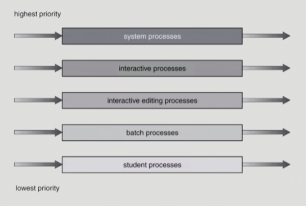
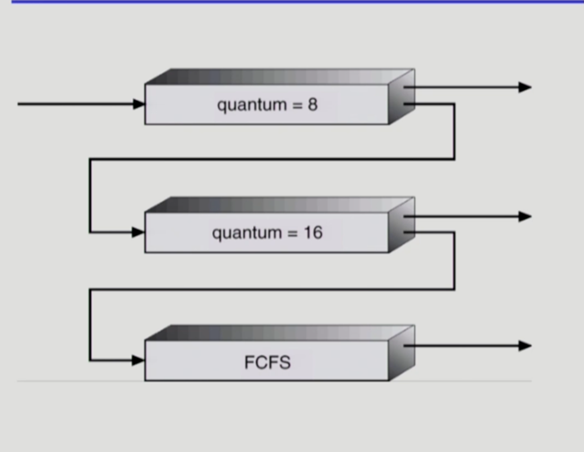

## CPU and I/O Bursts in Program Execution

프로그램에 따라서 조금씩 차이가 있지만, 공통적으로 

`CPU burst` 🔁 `I/O burst`

(CPU만 사용) .. (I/O만 사용) 서로 번갈아가면서 .. 

### CPU - burst Time의 분포
.. 여러 종류의 job (= process)가 섞여 있기 때문에 CPU 스케줄링이 필요

프로세스 특성에 따라 두가지로 분류

- I/O bound process : CPU를 잡고 계산하는 시간보다 I/O에 많은 시간이 필요한 job (짧고 빈번)
- CPU-bound process : 계산 위주의 job

I/O job은 주로 사용자와 interactive하는 job 

→ 만약 CPU bound job이 오래 잡고 있으면? 사용자는 오래 기다려야 함 

→ 효율성을 생각해야 함 ..

⇒ CPU 스케줄링이 필요한 이유 

✔️ 누구한테, 우선으로 줄 것인가?

✔️ 언제 뺏을 것인가?

### CPU Scheduler & Dispatcher

**CPU Scheduler**

하드웨어? 소프트웨어? .. 운영체제 안에 있는 코드 

Ready 상태의 프로세스 중에서 이번에 CPU를 줄 프로세스를 고름 

**Dispatcher**

CPU 제어권을 CPU shceduler에 의해 선택된 프로세스에게 넘김 → 이 과정을 문맥교환 (context switch) 라고 함 

🤔 CPU 스케줄링이 필요한 경우?

: 프로세스에게 다음과 같은 **상태 변화**가 있는 경우

1. 오래 걸리는 작업(I/O 작업 등의)을 하러 간 경우 
2. 빼앗고 다른 프로세스에게 넘기는 경우 .. (time interrupt)
3. 1번의 작업이 완료된 경우 .. 당장 CPU를 얻으면 일이 끝나는 경우 (I/O 작업이 완료된 후)
4. 프로세스 종료 후 CPU 넘기는 경우 

→ 1, 4에서의 스케줄링은 자진반납-오래 걸리거나, 할 일이 끝났거나 (= **nonpreemptive**) .. 그 외는 강제로 (= **preeptive)**

## CPU and I/O Bursts in Program Execution

컴퓨터 프로그래밍이 실행될 때, 일련의 단계가 실행 (프로그램 종류마다 조금씩 다름 .. CPU burst 가 많은 프로그램 .. I/O burst 가 많은 프로그램 ..

→ 두가지 단계가 번갈아 가면서 실행 

(모든 프로그램 별로 다른 단계를 갖고 있기 때문에, CPU 스케줄링이 필요함)

: 현재 ready queue에 들어있는 프로세스 중에서 어떤 프로세스에 CPU를 줄 것인지에 대한 ..

크게 두가지 이슈

1. 누구한테 지금 당장 CPU를 줄 것인가
2. CPU를 주었다면, 언제까지 주어야 하는가

비선점형/선점형 

성능 척도 → 어느 것이 좋은 것인가!

## 성능척도

크게 두가지 입장에서 볼 수 있음

### 시스템 입장에서

CPU 하나로 최대한 일을 많이 시키는 것 

- 이용률 (CPU utilization)
    
    전체 시간 중 CPU가 일한 시간의 비율 
    
    CPU는 가능한 바쁘게 일하고 있어야 함 
    
- 처리량 (Throughput)
    
    주어진 시간에 일을 몇개를 처리했는가
    

### 프로세스 입장에서

CPU를 빨리 얻어서, 빨리 끝나는 것 (→ 시간과 연관) .. 시간의 개념을 3가지로 나눔

- 소요 시간, 반환 시간 (Turnaround Time)
    
    CPU를 쓰러 **들어와서, 다 쓰고 나갈 때까지 걸린** 시간을 의미 
    
- 대기 시간 (Waiting Time)
    
    CPU를 얻을 때까지 **기다린** 시간 (줄 서서 기다린 시간)
    
- 응답 시간 (Response Time)
    
    ready queue에 들어와서, **처음으로 CPU를 얻기까지** 걸린 시간 
    

```
Waiting Time 과  Response Time의 차이는 ?
preemptive 타입은 CPU를 쓰다가 다시 CPU를 빼앗길 수 있음 ... 또 CPU를 얻었다가 ...
→ 이 기다린 시간을 모두 합친 것이 waiting time

최초로 CPU를 얻기까지 기다린 시간 .. 사용자 입장에서 처음으로 응답을 받은 것 
→ response time
```


## CPU 스케줄링 알고리즘

### FCFS (First-Come First-Served)

비선점형 → 내놓을 때까지는 빼앗지 않음

- 먼저 온 순서대로 처리
- Convey Effect : 처리시간이 긴 프로세스가 먼저 도착하게 되면, 뒤에서 계속 밀리게 되는 현상`short process behind long process`

### SJF (Shortest Job First)

- CPU burst time이 짧은 프로세스를 가장 먼저 스케줄
- 평균 대기 시간이 가장 짧음
- 2가지 방식
    - Nonpreemptive
        
        일단 CPU를 잡으면 이번 CPU burst가 완료될 때까지 CPU를 선점 당하지 않음 (해당 프로세스가 내놓기 전까지 갖고 있음)
        
    - Preemptive
        
        CPU를 주었다가 하더라도, 더 짧은 프로세스가 도착하면 그 프로세스에게 넘겨줌 
        
        **CPU Burst Time이 더 짧은 프로세스가 도착하면, 언제든지 스케줄링이 변경될 수 있음** 
        
        → preemptive 버전의 SJF == Shortest Remaining Time First (SRTF) 라고 부르기도 함 
        
- SJF is Optimal → 주어진 프로세스에 대해 최소 대기 시간을 보장 (preemptive 버전의 경우에 해당)


```
🤔 **제일 좋은 것 아닌가?**
2가지 이슈가 있음

1. Starvation
CPU 사용 시간이 긴 프로세스는 평생 기다리기만 해야 함 
Long process는 starvation이 될 수 있음

2. CPU 사용시간을 미리 알 수 없음
실제로는 CPU 사용시간을 알 수 없기 때문에 
→ 그러나, 추정은 가능!!
: interactive한 process는 Cpu burst가 짧음
  , 또한 CPU 사용 과거의 기록을 보고 예측을 함(가중합 - exponential averaging)
```


### Priority Scheduling

- 우선순위가 높은 프로세스에게 CPU를 주는 방식 (숫자가 작을 수록 우선순위가 높은 것으로 고려, 정수로 표현)
- 마찬가지로 nonpreemptive 방식과 preemptive 방식으로 나눠서 생각할 수 있음
- SJF처럼 starvation 문제가 발생함
    
    Starvation 문제를 어떻게 해결하는가? → **Aging 기법으로 해결할 수 있음 : 언젠가는 CPU를 얻게 되므로**(대기 시간이 길수록 우선 순위를 높임)
    

### Round Robin (RR)

현대적인 CPU는 라운드로빈 방식을 기반으로 작동

- 각 프로세스는 동일한 크기의 할당 시간 (time quantum) 을 갖고 있음
- 할당 시간이 지나면 프로세스는 선점을 당하고 ready queue의 제일 뒤로 가서 다시 줄을 섬
   
    → CPU를 길게 쓰는 프로세스는 기다리는 시간도 길어지고, CPU를 짧게 쓰는 프로세스는 기다리는 시간도 짧아짐

- `응답 시간이 빠름` (어떤 프로세스여도 CPU를 한번씩은 갖게 됨)
- CPU 사용시간을 미리 알 수 없다고 해도, CPU 사용시간이 적은 프로세스는 할당된 시간 동안 빠르게 작업을 하고 나갈 수 있음 → 굳이 예측할 필요 없음
- 할당시간이 너무 많으면? FCFS
- 할당시간이 너무 짧으면? context switching이 너무 많아지므로 오버 헤드 발생

> 일반적으로 SJF보다 average turnaround time이 길지만 response time은 더 짧다.


## Multilevel Queue
<p align="center">
  
</p>

(그동안) Ready Queue에 CPU를 기다리는 방식 → 한줄 서기 
 
위의 그림과 같이 여러 줄로 설 수 있음 >> CPU는 1개인데 줄이 여러 개이므로 **고려할 것**들이 있음

**무엇을 고려할 것 인가?**

1. 프로세스를 어느 줄에?
2. 어느 줄에 우선권을 주는가?

→ 줄이 정해져 있고, 프로세스가 우선순위에 따라서 줄을 서는 것 

> CPU가 어떻게 할당을 하는가?
> 
> 우선순위가 높은 줄에 먼저 할당 (출신에 따라서 .. 영원히 계급을 극복하지 못함 .. ㅠ)

- Ready Queue를 여러개로 분할
    - foreground → interactive
    - background → batch (사용자와의 인터랙션 없이 CPU를 사용)
- 각 줄(큐)마다 스케줄링 방식이 필요
    - foreground → RR (사용자와의 인터랙션이 있으므로)
    - background → FCFS (문맥교환을 줄이기 위해서)
- 줄(큐) 안에서 누구에게 CPU를 줄 것인가? 어떻게 우선순위를 매길 것인가?
    - Fixed Priority Scheduling
        
        우선 순위가 높은 줄부터 CPU 할당 
        
        → starvation 현상이 발생할 수 있음 
        
    - Time Slice
        
        각 큐에 CPU 시간을 적절한 비율로 할당 
        
        (ex. 전체 CPU 시간의 80%는 우선 순위가 높은 큐에 할당, 20%는 우선 순위가 낮은 큐에 할당)
        

~~.. 공정하지 않고 차별적임 ..~~ 

## Multilevel Feedback Queue

<p align="center">
  
</p>

→ 우선순위가 바뀔 수 있음 (.. like 현대사회)

- 프로세스가 다른 줄(큐)로 이동 가능
- aging을 이와 같은 방식으로 구현 가능
- Multilevel Feedback Scheduling을 정의하는 파라미터
    - Queue의 수
    - 각 큐의 스케줄링 알고리즘
    - 프로세스를 상위 큐로 보내는 기준
    - 프로세스를 하위 큐로 내쫓는 기준
    - 프로세스가 CPU 서비스를 받으려 할 때 들어갈 큐를 결정하는 기준
    
    .. 이러한 기준에 따라서 우선순위가 결정
    
    >> 보통은? 처음 들어오는 프로세스는 우선순위가 높은 큐(CPU 할당시간이 짧음)로 → 아래 큐로 강등 → .. 마지막 큐는 FCFS로 
    
    >> CPU 사용 시간이 짧으면 처음에 들어와서 사용하고 바로 나가, 오래 걸리면 다음 큐로 이동하면서 CPU 할당 시간은 긴데, 우선 순위가 낮도록 
    
    >> 사용 시간 예측 필요 없음 + CPU 사용시간이 짧은 프로세스가 우선시
    

## 특이한 케이스에서의 CPU 스케줄링

### Multiple-Processor Scheduling (= CPU가 여러 개일 때)

- CPU가 여러 개인 경우 스케줄링은 더욱 복잡해짐
- Homogeneous Processor :
- Load Sharing : 특정 CPU만 일하면 안되고 적절히 분배가 되어야 함
- Symmetric Mulitiprocessing : 각 프로세서가 알아서 스케줄링 결정 (모든 CPU가 동등)
- Asymmetric Mulitiprocessing : 하나의 CPU가 전체적인 컨트롤을 담당, 하나의 프로세서가 시스템 데이터의 접근/공유를 책임지고 나머지 프로세서는 거기에 따름

### Real-Time Scheduling (= Deadline이 정해진 스케줄링)

**Hard real-time systems**

정해진 시간 안에 **반드시 끝내도록** 스케줄링

**Soft real-time computing**

반드시 지키기보다, 일반 프로세스에 비해 높은 우선순위를 갖도록 해야 함 >> deadline을 보장x

### Thread Scheduling

- 쓰레드
    
    프로세스 하나 안에 CPU 수행 단위가 여러개 .. 
    
1. User Level 쓰레드 → Local Scheduling 
    
    : 사용자 수준의 쓰레드 라이브러리에 의해 어떤 쓰레드를 스케줄링할 지 결정 (사용자 프로세스가 직접)
    
2. Kernel Level 쓰레드 → Global Scheduling
    
    : 일반 프로세스와 마찬가지로 커널의 단기 스케줄러가 어떤 쓰레드를 스케줄링할 지 결정 
    

## Algorithm Evaluation
(= 어떤 알고리즘이 좋은지 평가하는 방법)

1. Queueing models (이론적인 방법)
    
    : 확률 분포로 주어지는 arrival rate와 service rate 등을 통해 각종 performance index 값을 계산
    
2. Implementation & Measurement (실제 시스템에 구현, 돌려보고 성능 측정, 실측)
    
    : 실제 시스템에 알고리즘을 구현하여 실제 작업에 대해서 성능을 측정 
    
3. Simulation 
    
    : 알고리즘을 모의 프로그램으로 작성 후 trace를 입력으로 하여 결과 비교
    
---

## 데이터의 접근

컴퓨터 시스템 안에서 데이터가 접근되는 패턴
데이터가 있고 >> 그 데이터를 갖고 와서 >> 연산 처리 >> 연산 결과 반영 

(누가 먼저 읽는지에 따라서 문제가 발생할 수 있음)

---

## Race Condition
→ S-box를 공유하는 E-box가 여러개 있는 경우, Race Condition의 가능성이 있음

→ 원하지 않은 결과가 나올 수 있음

.. 과연 컴퓨터 내에서 많이 생기는 문제인가? mulitiprocessor system / 공유 메모리를 사용하는 프로세스들 / **커널 내부 데이터를 접근**하는 루틴들 간 (ex. 커널 모드 수행 중 인터럽트로 커널 모드 다른 루틴 수행시) 

(유저 레벨에서는 큰 문제가 생기지 않지만, 커널 레벨에서는 생김) 

---

## OS에서의 race condition

### 예제 1 - Interrupt handler VS kernel
→ 커널 모드 실행 중 인터럽트가 발생 >> 인터럽트 처리 루틴이 수행 (→ 양쪽 다 커널 코드이므로 커널 주소 공간을 공유)

<aside>
🤔 어떻게 문제를 해결하는가?

- 중요한 값을 건들이는 동안에는
- 인터럽트가 들어와도
- 인터럽트 처리 루틴으로 가는 것이 아니라
- 해당 작업이 끝날 때까지는 인터럽트 처리를 하지 않음
</aside>

📌 **결국에는, 순서를 정해주면 됨 !!**

### 예제 2- Preempt a process running in kernel?
→ 어떠한 프로세스 실행? 본인의 코드만 실행되는 것이 아니라, 시스템 콜을 통해서 구현되는 것도 있음 (= 유저모드와 커널모드를 번갈아가면서 실행)

→ 실제로는 프로세스 A와 B 모두 커널에 접근해서 ++을 하므로, 2가 증가해야 하지만 커널 접근 도중에 인터럽트가 되어서 B의 커널 모드가 실행되므로 하나가 반영되지 않음

<aside>
🤔 **어떻게 문제를 해결하는가?**
프로세스가 커널 모드에 있을 때는 할당 시간이 끝나도, CPU를 빼앗지 않도록 (→ 커널 모드에서 사용자 모드로 돌아갈 때 preempt)

</aside>

### 예제 3 - mulitiprocessor
→ CPU가 여러 개 있는 환경 : 앞의 방법 그 어떤 것으로도 해결 되지 않음 

<aside>
🤔 **어떻게 문제를 해결하는가?**

1. CPU가 데이터를 들고 갈 때 lock을 걸어야 함 → 데이터 과정이 끝나면 lock을 풀기 (개별 데이터에 대해서 lock을 걸고 풀기)

2. 커널을 접근하는 CPU를 1개로 제한

</aside>

---

## Process Synchronization 문제

- 공유 데이터의 동시 접근은 데이터의 **불일치 문제**를 발생시킬 수 있음
- 일관성 유지를 위해서는 협력 프로세스 간의 **실행 순서를 정해주는 메커니즘** 필요

**Race Condition**

- 여러 프로세스들이 동시에 공유 데이터를 접근하는 상황
- 데이터의 최종 연산 결과는 마지막에 그 데이터를 다룬 프로세스에 따라 달라짐

→ **concurrent process는 `동기화` 되어야 함**

## 용어

### 임계구역 (= Critical Section)
n개의 프로세스가 공유 데이터를 동시에 사용하기를 원하는 경우, 각 프로세스의 code segment에는 공유 데이터를 접근하는 코드인 critical section이 존재

📌 문제 📌

하나의 프로세스가 critical section에 있을 때 다른 모든 프로세스는 critical section에 들어갈 수 없어야 함

→ 자유로워졌을 때 공유 데이터에 접근할 수 있어야 함 

📌 해결 📌

... 다음 시간에 .. 

---

## 추가

### 프로세서
Processor (프로세서)는 하드웨어적인 측면에서 "컴퓨터 내에서 프로그램을 수행하는 하드웨어 유닛"이다.  
이는 중앙처리장치(Central Processing Unit)를 뜻하며 폰노이만 아키텍쳐에 의해 만들어졌다면 적어도 하나 이상의 ALU (Arithmetic Logic Unit)와 처리 레지스터(Register)를 내장하고 있어야 한다.
---
📌 프로세서는 하드웨어에만 사용되는 용어는 아닙니다.📌 

소프트웨어적으로도 의미를 가지며 프로세서라고 불리는 프로그램들도 있습니다. 

소프트웨어적으로 프로세서라 함은 데이터 포맷을 변환하는 역할을 수행하는 데이터 프로세싱 시스템(데이터 처리 시스템)을 의미하며 출력 가능한 인쇄물을 생성하는 워드프로세서도 프로세서라 부른다.

조금 애매하긴 합니다만 위의 범주에 포함되는 소프트웨어는 워드프로세서와 컴파일러, 어셈블러 등이 포함됩니다. 프로세서라는 용어의 정의가 명확하게 정의되기 훨씬 이전부터 관습적으로 프로세서라고 부르던 소프트웨어들을 넓은 의미의 프로세서에 포함시켜주는 분위기가 강합니다.

> 이에 따라 프로세서는 CPU나 Microprocessor 라는 하드웨어를 말하는 것으로 그 범위가 점점 축소되어 명확해져 가고 있습니다.

### 프로세스
프로세스는 말 그대로 "절차(과정)" 입니다. 때문에 스스로 무언가를 처리하지 못합니다. 프로그램은 스스로 실행하면서 데이터를 입력받고 결과를 생성해 내니 "프로세서"라고 불러도 되지 않느냐라고 반문하는 사람도 있었습니다. 하지만 그것은 분명 틀린 논리입니다.

작업의 과정이 파일로 저장되어 있으면 그것을 "프로그램"이라고 부르고 메모리에 적재되어 실행 중 이거나 실행 대기 중일 땐 "프로세스"라고 구별하여 부를 뿐입니다. 즉 프로세스는 "메모리에 적재되어 프로세서에 의해 실행중인 프로그램" 이라고정의하는 것이 정확할 것입니다.


## 멀티 프로세스, 멀티 테스킹, 멀티 스레드

### 멀티 프로세싱(Multi-processing)

멀티 프로세싱: 다수의 프로세서가 다수의 프로세스를 동시에 처리하는 것

멀티 프로그래밍: 다수의 프로세스를 메모리에 적재하여 프로세스를 번갈아가면서 처리하는 것

멀티 태스킹: 다수의 작업을 운영체제 스케줄링에 의해  번갈아가면서 처리하는 것


프로세서(Processor)는 CPU라고 생각하면 되며, 프로세스(Process)와 다른 개념이다.

각 프로세서는 다수의 프로세스를 처리하며, 각 프로세스는 다수의 프로세서에 의해 처리된다.

각 프로세서가 자원을 공유하면서 프로세스를 처리하기 때문에, 하나의 프로세서가 고장 나더라도 작업(JOB)은 정지되지 않는다. 즉, 여러 개의 프로세서가 작업을 병렬처리 하는 것으로 정의하는 것이 정확한 개념일 것이다.


### 멀티 스레딩(Multi-threading)

멀티 스레딩은 하나의 프로세스를 다수의 스레드로 구성하여 서로 자원을 공유하고, 이를 통해 자원을 효율적으로 사용하여 작업 처리 속도를 향상시키는 것이다.

각 스세드는 프로세스 내에 존재하며, 코드/데이터/힙 영역을 공유하면서 데이터를 주고받을 수 있다. 이러한 장점 때문에, 프로세스 간 통신(IPC)에 비해 통신 오버헤드가 적고 속도가 빠르다.

멀티 스레딩을 통해 시스템의 처리량이 향상되고, 자원 소모가 줄어들어 프로그램의 응답시간이 단축된다.


**멀티스레딩의 문제점**

> 자원을 고융하기 때문에, 다수의 스레드가 특정 자원을 동시에 사용하는 것을 고려해야 한다. 즉, 동기화 처리가 필요하다.
>
> 동기화를 통해 스레드의 작업 처리 순서와 공유 자원에 대한 접근을 제어해야 한다.
>
> 일반적으로 락(Lock)을 이용하여 동기화 처리를 하는데, 락이 과도하면 병목 현상이 발생하여 성능 저하를 유발할 수 있다.

 
