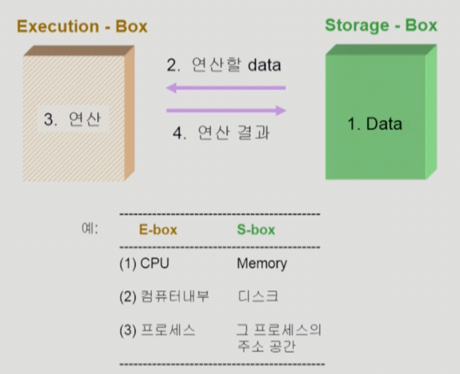
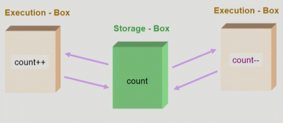
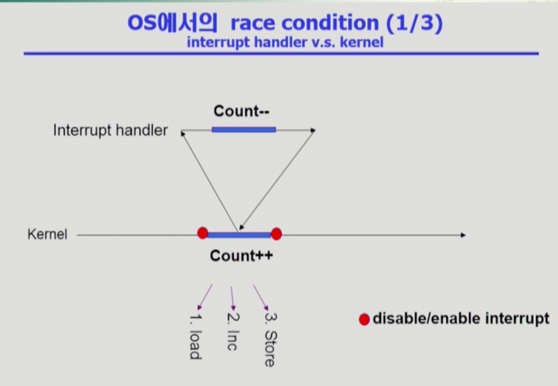
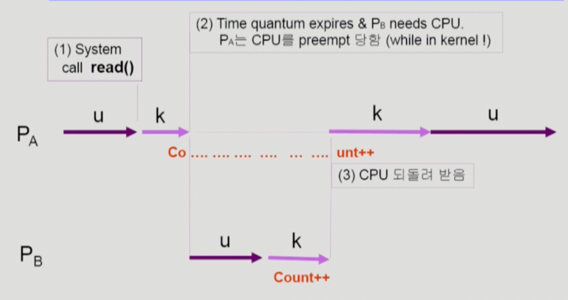
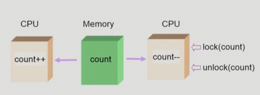
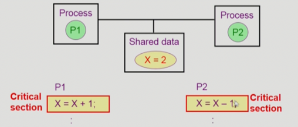

## Process Synchronization

Storage-Box(Memory Address Space): S-box

Execution-box(CPU Processor): E-box

<p align="center">
  
</p>
### 데이터의 접근

데이터가 저장되어 있는 위치(storage) 🔁 연산(CPU)

`연산할 데이터를 storage에서 읽어서 연산하는 CPU에서 연산을 하고 연산 결과를 storage에 저장`

### Race Condition

S-box를 공유하는 E-box가 여럿 있는 경우 Race Condition의 가능성이 있음

→ Multipleprocessor system 

→ 공유 메모리를 사용하는 프로세스들(`메인 메모리 상에서 프로세스간 겹치는 메모리`) 커널 내부 데이터를 접근하는 루틴들 간
- (예: 커널 모드 수행 중 인터럽트로 커널모드 다른 루틴 수행시)
- 커널의 코드가 실행된다는 것은 커널에 있는 data를 접근하는 것(동시다발적으로 인터럽트되면 Race Condition발생)

<p align="center">
  
</p>

✔️ OS에서 race condition은 언제 발생하는가?

1. Kernel 수행 중 인터럽트 발생시
(**interrupt handler vs kernel ?**)

   - count++: 하나의 명령을 여러개의 수행과정으로 CPU는 나뉘어서 진행함 
     1. 메모리의 저장되어있는 값을 레지스터에 로딩하고

     2. 레지스터 값을 1 증가시키고, 

     3. 레지스터값을 메모리에 저장
   
   - 만약 load하는 과정에서 인터럽트가 들어오면, ISR로 넘어감
   
   - Solution: 인터럽트가 들어오더라도 락이 걸려있으면, 작업이 끝날 때까지 인터럽트 처리를 안함(`순서`)

<p align="center">
  
</p>


2. Process가 system call을 하여 kernel mode로 수행 중인 context swtich가 일어나는 경우
(**Preempt a process running in kernel?**)

    - 두 프로세스의 address space 간에는 data sharing이 없음

    - 그러나 system call을 하는 동안에는 kernel address space의 data를 access하게 됨(`share`)

    - 이 작업 중간에 CPU를 preempt 해가면 race condition 발생

    - Solution: 커널 모드에서 수행 중일 때는 CPU를 preempt하지 않음 커널 모드에서 사용자 모드로 돌아갈 때 preempt
   
    - 즉 커널모드로 들어가면 time quantum을 오버하더라도 뺏지 않음!!

<p align="center">
  
</p>
 
3. Multiprocessor에서 shared memory 내의 kernel data

    - 어떤 CPU가 마지막으로 count를 store 했는가? `race condition`
    - multiprocessor의 경우 interrupt enable/disable로 해결되지 않음

✔ 방법 1:️ 한번에 하나의 CPU만이 커널에 들어갈 수 있게 하는 방법
✔ 방법 2:️ 커널 내부에 있는 각 공유 데이터에 접근할 때마다 그 데이터에 대한 lock/unlock을 하는 방법 

<p align="center">
  
</p>

```
Process Synchronization 문제
- 공유 데이터의 동시 접근(concurrent access)은 데이터의 불일치(inconsistency)를 발생시킬 수 있다
- 일관성(consistency)유지를 위해서는 협력 프로세스(cooperating process)간의 실행 순서(orderly execution)를 정해주는 메커니즘 필요

- Race condition:
    - 여러 프로세스들이 동시에 공유 데이터를 접근하는 상황
    - 데이터의 최종 연산 결과는 마지막에 그 데이터를 다룬 프로세스에 따라 달라짐

- race condition을 막기 위해서는 concurrent process는 동기화 되어야 한다.
```

### The Critical-Section Problem

<p align="center">
  
</p>

- n 개의 프로세스가 공유 데이터를 동시에 사용하기를 원하는 경우

- 각 프로세스의 code segment에는 공유 데이터를 접근하는 코드인 critical section이 존재

🤔 Problem

- 하나의 프로세스가 critical section에 있을 때 다른 모든 프로세스는 critical section에 들어갈 수 없어야 한다.

---

### Initial Attempts to Solve Problem

두 개의 프로세스가 있다고 가정 P0, P1

프로세스들은 수행의 동기화(synchronize)를 위해 몇몇 변수를 공유(`synchronization value`)할 수 있다. 
