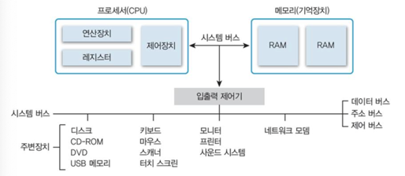
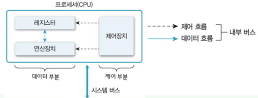
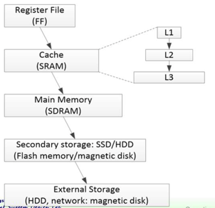

# 컴퓨터 시스템의 소개

## 컴퓨터 하드웨어의 구성

컴퓨터 시스템
- 논리연산을 수행하는 물리적인 기게장치인 하드웨어와 hardware에 작업을 지시하는 명령어로 구성된 프로그램인 소프트웨어로 구성

컴퓨터 하드웨어
- 프로세서, 메모리(기억장치), 주변장치로 구성되고, 이들은 시스템 버스로 연결

<p align="center">
  
</p>

```
연산장치: ALU
레지스터: 임시 저장 장치
프로세서가 직접 접근할 수 있는 유일한 저장 장치는 메모리
I/O 장치는 입출력 제어기를 통해 간접적으로 접근 
```

---

### Processor
Clock

- 컴퓨터 시간은 흔히 cycle의 수를 통해 측정
  
  - Cycle - 시스템 clock 생성기가 보낸 전기 신호의 한 주기
  
  - clock 생성기는 각 장치가 요구하는 주파수의 clock 생성
    - 초당 cycle 수 (Hz)로 측정, 일반적으로 높은 주파수는 높은 성능을 의미
    
Processor(CPU 중앙처리장치)

- 컴퓨터 하드웨어 구성 요소 중 운영체제와 가장 밀접한 부분으로, 컴퓨터의 모든 장치의 동작을 제어하고 연산 수행

<p align="center">
  
</p>

```
프로세서는 결국 디지털 로직 회로이므로 0/1이 반복되는 Pulse, 즉 Clock의 정보만 이해할 수 있다.

산술이나 로직 연산은 연산 장치에서 이루어지고, 레지스터에는 연산에 필요한 정보를 저장한다.

제어장치(decoder): 프로세스가 명령어를 읽을 때, 명령어를 해석해서 적절한 제어 신호를 만든다. 만들어진 제어 신호에 따라서 적절한 데이터(레지스터에 저장된 데이터)를 이용
```

Processor's register

- 프로세서 내부에 있으며, 프로세서가 사용할 데이터를 보관하는 가장 빠른 메모리

- 용도:
  - 전용 레지스터: 
    - PC(Program Counter): 다음 명령어의 주소가 저장되어있는 레지스터 
    - IR(instruction register): 읽어온 명령어를 임시로 저장하는 레지스터
  - 범용 레지스터: 일반적인 데이터를 저장하는 레지스터

- 사용자가 정보 변경 가능 여부:
  - user-visible 레지스터 : R-W user program
  - user-invisible 레지스터

- 저장하는 정보의 종류
  - 데이터 레지스터
  - 주소 레지스터
  - 상태 레지스터

```
한 줄 요약:
프로세서는 시스템 버스를 통해서 메모리와 연결되고, 메모리에 있는 명령어를 읽어서 IR에 저장하고 decoding을 통해 연산 장치를 제어 다음 주소는 PC에 저장한다.
```

---

### Memory

<p align="center">
  
</p>

- Memory는 계층적인 구조로 구성하여 비용, 속도, 용량, 접근 시간등을 상호 보완

- register file → HDD
  - 용량 ↑
  - 성능 ↓
  - 프로세서와의 거리 ↑
  - 접근 빈도 ↓ 

메인 메모리

- 프로세서 외부에 존재

- 프로세서에서 수행할 프로그램과 데이터(read), 프로세서에서 처리한 결과 저장(write)

- 주기억장치 또는 1차 기억장치는 저장 밀도가 높고 가격이 싼 DRAM(Dynamic RAM)을 많이 사용

- 메모리 성능은 memory access time, memory cycle time으로 표현(`프로세서와 메인 메모리 간에 속도 차이`)
  - memory access time : 첫 번쨰 데이터가 나올 때까지 걸리는 시간
  - memory cycle time : 마지막 신호가 나올 때까지 걸리는 시간

- Address를 이용하여 참조
- 하나의 주소값은 일반적으로 8bit
  - 프로세서에 따라 달라질 수 있음
- Address가 n비트라면 주소 공간은 2^n - 1
```
프로세서는 메인 메모리에 접근하는 명령어를 보내지만 실질적으로 중간에 Cache가 있어서 데이터를 Cache에서 읽어들이는 경우가 훨씬 많다
```

Cache

- 프로세서 내부나 외부에 있으며, 처리 속도가 빠른 프로세서와 상대적으로 느린 메인 메모리의 속도 차이를 보완하는 고속 버퍼

- 메인 메모리에서 데이터를 블록 단위로 가져와 프로세서에 워드 단위로 전달하며 속도를 높임

```
고속 메모리(SRAM)

캐시 적중(cache hit): 참조하는 정보가 캐시 메모리에 있는 경우
캐시 실패(cache miss): 참조하는 정보가 메모리에 없는 경우

실제 프로그램을 실행할 때 참조한 메모리에 대한 spatial locality와 temporal locality 이용
    - Spatial locality: 대부분의 프로그램이 참조한 주소와 인접한 주소의 내용을 다시 참조하는 특성
    - Temporl locality: 한번 참조한 주소를 곧 다시 참조하는 특성
   
예)
    - L1, L2 프로세서 캐시
    - 메인 메모리의 일정 부분을 할당해 2차 저장소의 데이터를 캐싱

프로세서와 cache 사이에는 cache controller가 있어서 cache에 주소를 보고 그 데이터가 존재하면 cache에서 바로 읽어 들이고 아니면, 메인 메모리에 접근한다.

캐시의 용량은 L1 64kb, L2 1M ~ 2,3MB, L3 8~12MB 

따라서 캐시 실패가 대부분 일어날 것이라 예측된다. 
그러나 자주 부르는 fuction 또는 반복문 같은 것들을 캐시에 넣어 놓기에 cache hit이 발생확률이 높다.
Cache hit → 90 ~ 95 %
```

Buffer

- 전송속도에 차이가 있는 두 장치 사이에서 임시로 데이터를 저장하여 그 차이를 완하하는 장치
  - 소프트웨어와 하드웨어 장치들이 데이터를 비동기적으로 전송하게 함으로써 시스템 성능 향상

Spool

- CPU와 저속 입출력장치가 독립적으로 동작하도록 고안된 소프트웨어적인 버퍼

- 예) Spooler
  - 프린트할 내용을 스풀러에 저장을 하면 프로세서와 스풀러의 관계는 끝
  - 이후 스풀러는 프린터와 연결해서 프린터 작업을 실행(프린터로 전송될 데이터를 하드디스크에 잠시 저장)
  - 출력 명령을 내린 프로그램과 독립적으로 동작하여 실제 인쇄
  
---

### System bus

- 하드웨어를 물리적으로 연결하여 서로 데이터를 주고받을 수 있게 하는 통로

- 컴퓨터 내부의 다양한 신호(데이터 입출력, 프로세서 상태, 인터럽트 요구및 처리)를 시스템 버스로 전달

- 기능에 따라 데이터 버스, 주소 버스, 제어 버스로 구분
  - 데이터 버스: 프로세서와 메인 메모리, 주변장치 사이에서 데이터를 전송. 데이터 버스를 구성하는 배선 수는 프로세서가 한 번에 전송할 수 있는 비트 수를 결정하는데, 이를 워드라고 한다.
  - 주소 버스: 프로세서가 시스템의 구성 요소를 식별하는 주소 정보를 전송한다. 주소 버스를 구성하는 배선 수는 프로세서와 접속할 수 있는 메인 메모리의 최대 용량을 결정한다.
  - 제어 버스: 프로세서가 시스템의 구성 요소를 제어하는 데 사용한다. 제어 신호로 연산장치의 연산 종류와 메인 메모리의 읽기나 쓰기 동작을 결정한다.

---

### Peripherals

- 프로세서와 메인 메모리를 제외한 나머지 하드웨어 구성 요소
- 종류:
  - 입력 장치
  - 출력 장치
  - 보조 기억 장치(storage, 저장 장치)
    - 저장 장치: 영구적으로 데이터(프로그램)를 저장하는 장치. 데이터를 입력하여 저장하며, 저장한 데이터를 출력하는 공간이므로 입출력장치에 포함하기도 함
  - 통신 장치
  


